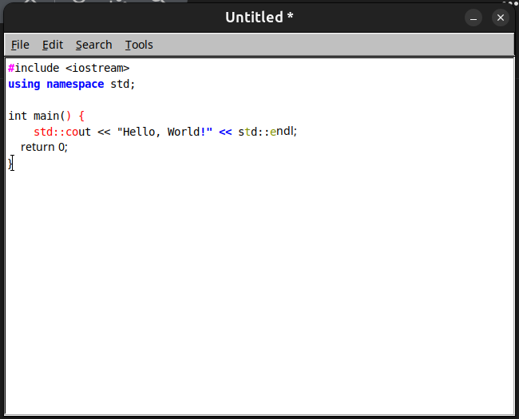

# FLTK C++ Text Editor

A lightweight, cross-platform text editor built with C++ and the [FLTK](https://www.fltk.org/) library. This project was developed as a learning exercise to understand the fundamentals of GUI application development, event handling, and text manipulation in C++.

## Screenshot




## Features

This editor includes a robust set of features that make it a functional tool for basic text and code editing:

*   **File Operations**:
    *   **New**: Create a new, empty document.
    *   **Open**: Load and display text files from your system.
    *   **Save**: Save the current file to its existing location.
    *   **Save As**: Save the current file to a new name or location.
    *   Includes a check for unsaved changes before closing or opening a new file.

*   **Standard Editing**:
    *   **Cut**, **Copy**, and **Paste** text using the menu or standard keyboard shortcuts.
    *   **Undo**: Revert the last editing action.

*   **C++ Syntax Highlighting**:
    *   Automatically applies colors and styles to C++ code.
    *   Highlights keywords, comments (both `//` and `/* ... */`), strings, preprocessor directives, and numbers.

*   **Search Functionality**:
    *   **Find**: A dialog to search for text within the document.
    *   **Find Next**: Jumps to the next occurrence of the search term.

*   **Tools**:
    *   **Word Count**: A pop-up dialog that displays the total word count of the current document.

## Dependencies

*   A C++ compiler (like `g++`)
*   The **FLTK library** (version 1.3 or newer)

## How to Build

You can compile the editor from source using the `editor.cpp` file.

#### Simple Build 

This is the easiest way to compile if you have FLTK installed on your system.

```bash
g++ editor.cpp -o my_editor -lfltk
```


## How to Run

After compiling, you can run the editor from your terminal:

```bash
./my_editor
```


